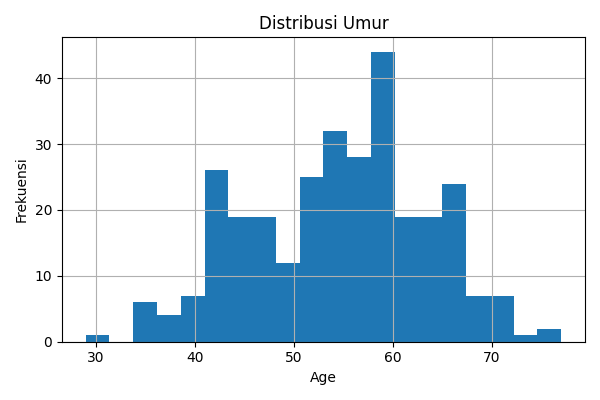
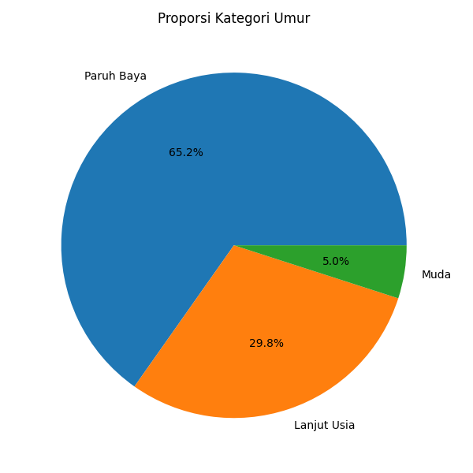
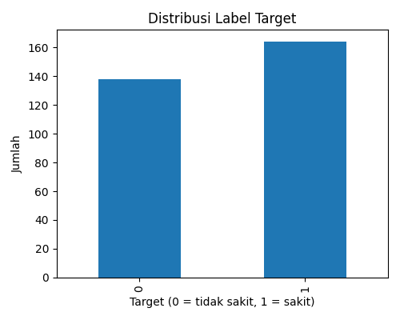

# Data Cleansing — Heart Disease Dataset

**Author:** Ana Maria Sri Utami (NIM 2318006) · Teknik Informatika, ITN Malang  
**Terakhir diperbarui:** 2025-10-02

Repo ini berisi notebook, data, dan artefak untuk tugas **Data Mining (Data Cleansing)**.  
Fokus: membersihkan dataset penyakit jantung, menghapus duplikat, memvalidasi nilai diskret, dan menambahkan fitur sederhana agar siap dianalisis.

---

## Isi Repo
```
.
├─ 2318006DataCleansing.ipynb        # Notebook Colab 
├─ heart.csv                         # Dataset asli
├─ heart_clean.csv                   # Dataset hasil cleansing
├─ artifacts/                        # Artefak untuk laporan/PPT/LinkedIn
│  ├─ summary_stats.csv
│  ├─ outlier_report_iqr.csv
│  ├─ hist_age.png
│  ├─ pie_age_category.png
│  ├─ bar_target.png
│  └─ log.json
└─ README.md

---

## Ringkasan Proyek
- **Baris awal:** 1025
- **Duplikat terdeteksi:** 723
- **Baris setelah dedup:** 302
- **Missing values:** 0
- **Rentang umur:** 29–77
- **Validasi domain diskret:** semua kolom diskret valid (0/1/… sesuai definisi di bawah)

Artefak visual:
- 
- 
- 

---

## Langkah Cleansing (sesuai modul)
1. **Statistik deskriptif**  
   Buat ringkasan numerik dan simpan ke `artifacts/summary_stats.csv`.
2. **Inspeksi nilai ekstrem (IQR)**  
   Hitung ambang IQR dan simpan laporan ke `artifacts/outlier_report_iqr.csv`.  
   *Tidak menghapus outlier* karena konteks medis masih masuk akal; hanya dilaporkan.
3. **Cek missing values**  
   Dataset ini tidak memiliki NA, jadi tidak dilakukan imputasi.
4. **Deduplikasi**  
   Hapus 723 baris duplikat menggunakan `drop_duplicates()`.
5. **Standarisasi nama kolom**  
   Ubah ke `lower_snake_case` agar konsisten.
6. **Validasi domain (nilai diskret)**  
   Pastikan kolom diskret hanya berisi nilai yang sah:
   - `sex: {0,1}`
   - `cp: {0,1,2,3}`
   - `fbs: {0,1}`
   - `restecg: {0,1,2}`
   - `exang: {0,1}`
   - `slope: {0,1,2}`
   - `ca: {0,1,2,3,4}`
   - `thal: {0,1,2,3}` (0 terkadang berarti unknown)
   - `target: {0,1}`
7. **Enrichment**  
   Tambahkan fitur `age_category` dengan tiga level: **Muda** (<40), **Paruh Baya** (40–59), **Lanjut Usia** (≥60).
8. **Simpan output**  
   Ekspor `heart_clean.csv` dan buat artefak grafik untuk laporan.

---

## Cara Menjalankan (Google Colab)
1. Buka Google Colab → jalankan kode mount Drive:
   ```python
   from google.colab import drive
   drive.mount('/content/drive')
   ```
2. Pastikan semua file berada di folder Drive yang sama.  
3. Jalankan notebook `2318006DataCleansing.ipynb` dari atas ke bawah.  
4. Output dan artefak akan tersimpan sesuai path yang disetel di cell pertama.

---

## Penjelasan Kolom (singkat)
- `age` (tahun), `sex` (0=perempuan, 1=laki-laki), `cp` (tipe nyeri dada), `trestbps` (tekanan darah istirahat),  
  `chol` (kolesterol), `fbs` (gula darah puasa), `restecg` (EKG), `thalach` (detak jantung maks), `exang` (angina saat latihan),  
  `oldpeak` (ST depression), `slope` (kemiringan ST), `ca` (jumlah pembuluh utama), `thal` (hasil thalassemia), `target` (label 0/1).

---

## Reproducibility
- Angka di bagian *Ringkasan Proyek* mengikuti hasil notebook pada dataset ini.  
- Jika memperbarui data atau kode, angka bisa berubah. Selalu rujuk `artifacts/log.json` sebagai kebenaran terakhir.

---

## Tautan
- **Notebook Colab:** _https://colab.research.google.com/drive/1AwkbSVhrvSBxlCdSa9ebwXI8iB-i0vTm?usp=sharing_  
- **Artikel Medium:** _https://medium.com/@analeeu740/data-cleansing-dengan-python-studi-kasus-heart-disease-dataset-fb1bfa6bee02_  
- **Postingan LinkedIn:** _(isi tautan)_

---

## Lisensi & Kredit
- Dataset: variasi **Heart Disease** yang umum digunakan untuk edukasi.
- Proyek dibuat untuk tugas mata kuliah **Data Mining (Data Cleansing)**.
